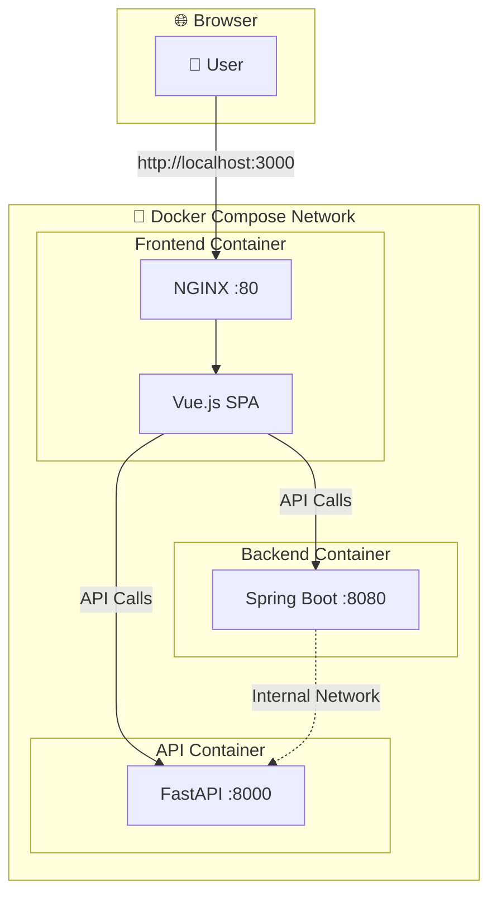

# NSPACE - Portfolio Website

Eine moderne Portfolio-Website im NSPACE-Design, entwickelt mit Vue 3, Java Spring Boot und Python FastAPI. Vollständig containerisiert mit Docker Compose für einfache Entwicklung und Deployment.

## 🚀 Features

- **Design**: Dunkles Hero-Layout mit animierten Sterneffekten im SpaceX-Stil
- **Vue 3 + Vite**: Moderne Frontend-Architektur mit Hot Module Replacement
- **Vue Router**: Single Page Application mit Navigation zwischen 4 Hauptbereichen
- **Java Spring Boot**: REST API Backend für Termine und Java-bezogene Services
- **Python FastAPI**: KI und Python-bezogene Services mit automatischer API-Dokumentation
- **Docker Compose**: Vollständige Containerisierung aller Services
- **NGINX**: Produktionsreifer Web-Server für das Frontend
- **Responsive Design**: Optimiert für Desktop und Mobile
- **NSPACE Branding**: Minimalistisches Logo und Navigation

## 📁 Detaillierte Projektstruktur

```
AIPROJEKT/                                    # 🏠 Root-Verzeichnis
│
├── 📄 docker-compose.yml                    # 🐳 Multi-Container Orchestrierung
├── 📄 README.md                             # 📖 Diese Dokumentation
│
├── 🚀 vue-frontend/                         # Frontend (Vue.js + NGINX)
│   ├── 📄 Dockerfile                        # Container-Build für Frontend
│   ├── 📄 nginx.conf                        # NGINX-Konfiguration (SPA-Routing)
│   ├── 📄 package.json                      # Node.js Dependencies & Scripts
│   ├── 📄 package-lock.json                 # Dependency-Lock-File
│   ├── 📄 vite.config.js                    # Vite Build-Konfiguration
│   ├── 📄 jsconfig.json                     # JavaScript/TypeScript Konfiguration
│   ├── 📄 index.html                        # HTML-Entry-Point
│   ├── 📁 public/                           # Statische Assets
│   │   └── 🖼️ favicon.ico                   # Website-Icon
│   ├── 📁 src/                              # Vue.js Quellcode
│   │   ├── 📄 App.vue                       # Hauptkomponente (Navigation + Router-View)
│   │   ├── 📄 main.js                       # JavaScript Entry-Point
│   │   ├── 📁 router/                       # Vue Router Konfiguration
│   │   │   └── 📄 index.js                  # Route-Definitionen
│   │   └── 📁 views/                        # Seiten-Komponenten
│   │       ├── 📄 Home.vue                  # Hero-Landing-Page (SpaceX-Design)
│   │       ├── 📄 Profile.vue               # Profil-Informationen
│   │       ├── 📄 TermineJava.vue           # Java-Termine Bereich
│   │       └── 📄 KiPython.vue              # KI Python Bereich
│   ├── 📁 dist/                             # Build-Output (wird von Docker verwendet)
│   └── 📁 node_modules/                     # Node.js Dependencies
│
├── ☕ java-backend/                          # Backend (Spring Boot)
│   ├── 📄 Dockerfile                        # Container-Build für Java
│   ├── 📄 pom.xml                           # Maven Dependencies & Build-Konfiguration
│   └── 📁 src/main/                         # Java Quellcode-Struktur
│       ├── 📁 java/com/nspace/              # Java Package-Struktur
│       │   └── 📄 JavaBackendApplication.java # Spring Boot Hauptklasse + REST-Controller
│       └── 📁 resources/                    # Konfigurationsdateien
│           └── 📄 application.properties    # Spring Boot Konfiguration
│
├── 🐍 python-backend/                       # Backend (FastAPI)
│   ├── 📄 Dockerfile                        # Container-Build für Python
│   ├── 📄 requirements.txt                  # Python Dependencies
│   └── 📄 main.py                           # FastAPI Hauptanwendung + API-Endpoints
│
└── 🛠️ Start-Skripte/                        # Automatisierung
    ├── 📄 start-frontend.sh                 # Bash-Skript: Nur Frontend starten
    ├── 📄 start-frontend.ps1                # PowerShell-Skript: Nur Frontend starten
    ├── 📄 start-all.sh                      # Bash-Skript: Alle Services starten
    └── 📄 start-all.ps1                     # PowerShell-Skript: Alle Services starten
```

## 🔗 Architektur & Datenfluss



## 📋 Datei-Details & Verantwortlichkeiten

### 🏠 Root-Level Dateien

| Datei | Zweck | Wichtige Inhalte |
|-------|-------|------------------|
| `docker-compose.yml` | Orchestriert alle 3 Container | Service-Definitionen, Netzwerk, Port-Mapping |
| `README.md` | Projekt-Dokumentation | Setup, Architektur, API-Docs |

### 🚀 Frontend (vue-frontend/)

| Datei/Ordner | Zweck | Technische Details |
|--------------|-------|-------------------|
| `Dockerfile` | Multi-Stage Build | Node.js Build → NGINX Runtime |
| `nginx.conf` | Web-Server Config | SPA-Routing, Proxy zu Backends |
| `package.json` | Dependencies | Vue 3, Vue Router, Vite, Dev-Tools |
| `vite.config.js` | Build-Tool Config | Alias `@` → `./src`, Vue-Plugin |
| `jsconfig.json` | IDE-Support | Path-Mapping für IntelliSense |
| `src/App.vue` | Root-Komponente | Navigation, Router-View, Global-Styles |
| `src/main.js` | Entry-Point | Vue-App erstellen, Router registrieren |
| `src/router/index.js` | Routing | Route-Definitionen, History-Mode |
| `src/views/Home.vue` | Landing-Page | SpaceX-Design, Hero-Section, CTA-Buttons |
| `src/views/Profile.vue` | Profil-Seite | Persönliche Informationen |
| `src/views/TermineJava.vue` | Java-Bereich | Placeholder für Java-Termine |
| `src/views/KiPython.vue` | KI-Bereich | Placeholder für KI-Projekte |

### ☕ Java Backend (java-backend/)

| Datei/Ordner | Zweck | Technische Details |
|--------------|-------|-------------------|
| `Dockerfile` | Container-Build | OpenJDK 17, Maven Build, JAR-Execution |
| `pom.xml` | Maven Config | Spring Boot 3.2.0, Web-Starter |
| `src/main/java/.../JavaBackendApplication.java` | Hauptklasse | Spring Boot App, REST-Controller |
| `src/main/resources/application.properties` | Spring Config | Port 8080, CORS, Profile-Settings |

### 🐍 Python Backend (python-backend/)

| Datei/Ordner | Zweck | Technische Details |
|--------------|-------|-------------------|
| `Dockerfile` | Container-Build | Python 3.11, Uvicorn ASGI-Server |
| `requirements.txt` | Dependencies | FastAPI, Uvicorn, Pydantic, CORS |
| `main.py` | Hauptanwendung | FastAPI App, API-Endpoints, CORS-Middleware |

## 🛠️ Setup & Installation

### Voraussetzungen

- **Docker Desktop**: Version 20.10+ (für Container-Orchestrierung)
- **Docker Compose**: Version 2.0+ (für Multi-Container-Setup)
- **Node.js**: Version 20.19.0+ (für lokale Frontend-Entwicklung)
- **Java**: Version 17+ (für lokale Backend-Entwicklung)
- **Python**: Version 3.11+ (für lokale API-Entwicklung)

### 🐳 Docker Setup (Empfohlen)

1. **Repository klonen/herunterladen**
   ```bash
   git clone [repository-url]
   cd AIPROJEKT
   ```

2. **Alle Services mit Docker Compose starten**
   ```bash
   docker compose up --build -d
   ```

3. **Services überprüfen**
   ```bash
   docker compose ps
   docker compose logs -f
   ```

4. **Browser öffnen**
   - **Frontend**: http://localhost:3000
   - **Java API**: http://localhost:8080
   - **Python API**: http://localhost:8000
   - **FastAPI Docs**: http://localhost:8000/docs

### 🚀 Start-Skripte verwenden

#### Frontend nur starten:
```bash
# Bash (Linux/Mac/WSL)
./start-frontend.sh

# PowerShell (Windows)
.\start-frontend.ps1
```

#### Alle Services starten:
```bash
# Bash
./start-all.sh

# PowerShell
.\start-all.ps1
```

### 💻 Lokale Entwicklung

#### Frontend (Vue.js)
```bash
cd vue-frontend
npm install
npm run dev
# → http://localhost:5173
```

#### Java Backend
```bash
cd java-backend
mvn spring-boot:run
# → http://localhost:8080
```

#### Python Backend
```bash
cd python-backend
pip install -r requirements.txt
uvicorn main:app --reload
# → http://localhost:8000
```

## 🎨 Design & Features

### Home-Seite (SpaceX-Style)
- **Fullscreen Hero**: Dunkler Hintergrund mit animierten Lichtkegeln
- **Sterneffekt**: CSS-basierte Partikel-Animation mit `@keyframes`
- **Call-to-Action Buttons**: Direkte Navigation zu Profil, Java, Python
- **Scroll-Indikator**: Animierte Maus mit Scroll-Hinweis
- **Responsive**: Optimiert für alle Bildschirmgrößen

### Navigation
- **NSPACE Logo**: Minimalistische Wortmarke mit Letter-Spacing
- **Outline-Buttons**: Elegante Hover-Effekte im SpaceX-Stil
- **Router-Integration**: Vue Router für SPA-Navigation

### Backend Services
- **Java Spring Boot**: REST API für Termine und Java-bezogene Services
- **Python FastAPI**: KI-Projekte, Machine Learning Services
- **CORS konfiguriert**: Frontend kann alle APIs erreichen
- **Docker-optimiert**: Alle Services laufen in Containern

## 🔧 Technische Details

### Frontend Stack
- **Vue 3.5.18**: Composition API, Reactivity System
- **Vue Router 4.5.1**: Client-side Routing, History Mode
- **Vite 7.0.6**: ESBuild, Hot Module Replacement
- **NGINX Alpine**: Produktions-Web-Server

### Backend Stack
- **Java Spring Boot 3.2.0**: Auto-Configuration, Embedded Tomcat
- **Python FastAPI 0.104.1**: Async Support, Auto-Documentation
- **Uvicorn**: ASGI Server für FastAPI

### Docker Services
- **vue-frontend**: Multi-Stage Build (Node.js → NGINX)
- **java-backend**: OpenJDK 17 + Maven + Spring Boot
- **python-backend**: Python 3.11 + FastAPI + Uvicorn

### Netzwerk-Konfiguration
- **Docker Network**: `app-network` für Service-Kommunikation
- **Port-Mapping**: 
  - Frontend: `3000:80` (Host:Container)
  - Java: `8080:8080`
  - Python: `8000:8000`
- **Service-Discovery**: Container-Namen als Hostnamen

## 🚀 Docker Commands

```bash
# Alle Services starten
docker compose up --build -d

# Logs ansehen
docker compose logs -f

# Einzelne Services
docker compose up vue-frontend -d
docker compose up java-backend -d
docker compose up python-backend -d

# Services stoppen
docker compose down

# Volumes und Images löschen
docker compose down -v --rmi all

# Services neu starten
docker compose restart [service-name]

# Container-Status prüfen
docker compose ps
```

## 🚀 Was bereits implementiert wurde

✅ **Vue 3 + Vite Setup**  
✅ **Vue Router Konfiguration**  
✅ **4 Hauptseiten mit Navigation**  
✅ **SpaceX-inspiriertes Hero-Design**  
✅ **Responsive Navigation mit NSPACE Branding**  
✅ **Animierte Sterneffekte und Hover-Interaktionen**  
✅ **Docker Compose Multi-Container Setup**  
✅ **Java Spring Boot Backend mit REST-APIs**  
✅ **Python FastAPI Backend mit KI-Projekten**  
✅ **NGINX Proxy für Frontend**  
✅ **CORS Konfiguration für alle Services**  
✅ **Start-Skripte für einfache Entwicklung**  
✅ **Vollständige Dokumentation**  

## 📝 Nächste Schritte

- [ ] Java Backend mit echten Termine-APIs implementieren
- [ ] Python Backend mit echten KI-Projekten erweitern
- [ ] Datenbank-Integration (PostgreSQL/MySQL)
- [ ] Authentication & Authorization
- [ ] API-Dokumentation (Swagger/OpenAPI)
- [ ] CI/CD Pipeline
- [ ] Monitoring und Logging
- [ ] Performance-Optimierung
- [ ] Unit Tests für alle Services
- [ ] Integration Tests

## 🎯 API Endpoints

### Java Backend (Port 8080)
- `GET /` - Service-Status
- `GET /health` - Health Check
- `GET /api/termine` - Alle Termine abrufen
- `POST /api/termine` - Neuen Termin erstellen

### Python Backend (Port 8000)
- `GET /` - Service-Status
- `GET /health` - Health Check
- `GET /api/ki/projects` - KI-Projekte abrufen
- `POST /api/ki/projects` - Neues KI-Projekt erstellen
- `GET /docs` - FastAPI Dokumentation (Swagger UI)
- `GET /redoc` - Alternative API-Dokumentation

## 🔄 Entwicklungsworkflow

### 1. Frontend-Entwicklung
```bash
cd vue-frontend
npm run dev
# Änderungen werden automatisch geladen
```

### 2. Backend-Entwicklung
```bash
# Java Backend
cd java-backend
mvn spring-boot:run

# Python Backend (neues Terminal)
cd python-backend
uvicorn main:app --reload
```

### 3. Vollständige Anwendung testen
```bash
docker compose up --build -d
# Alle Services laufen in Containern
```

### 4. Änderungen deployen
```bash
docker compose down
docker compose up --build -d
# Neue Images werden gebaut und gestartet
```

## 📞 Support & Troubleshooting

### Häufige Probleme

**Docker läuft nicht:**
```bash
# Docker Desktop starten
# Windows: Docker Desktop aus Startmenü
# Linux: sudo systemctl start docker
```

**Port bereits belegt:**
```bash
# Andere Services stoppen oder Ports in docker-compose.yml ändern
docker compose down
# Ports in docker-compose.yml anpassen
docker compose up -d
```

**Container startet nicht:**
```bash
# Logs prüfen
docker compose logs [service-name]

# Container neu bauen
docker compose up --build [service-name]
```

**Frontend zeigt leere Seite:**
```bash
# Browser-Cache leeren
# NGINX-Container neu starten
docker compose restart vue-frontend
```

### Debug-Commands

```bash
# Container-Status
docker compose ps

# Logs aller Services
docker compose logs -f

# Logs eines Services
docker compose logs -f vue-frontend

# In Container einsteigen
docker compose exec vue-frontend sh
docker compose exec java-backend bash
docker compose exec python-backend bash

# Netzwerk prüfen
docker network ls
docker network inspect aiprojekt_app-network
```

## 📊 Performance & Monitoring

### Ressourcen-Verbrauch
```bash
# Container-Ressourcen anzeigen
docker stats

# Spezifische Container
docker stats nspace-frontend nspace-java nspace-python
```

### Logs analysieren
```bash
# Logs in Datei speichern
docker compose logs > logs.txt

# Fehler-Logs filtern
docker compose logs | grep ERROR
```

---

**Entwickelt mit ❤️, Vue 3, Java Spring Boot und Python FastAPI**

*Letzte Aktualisierung: September 2025*