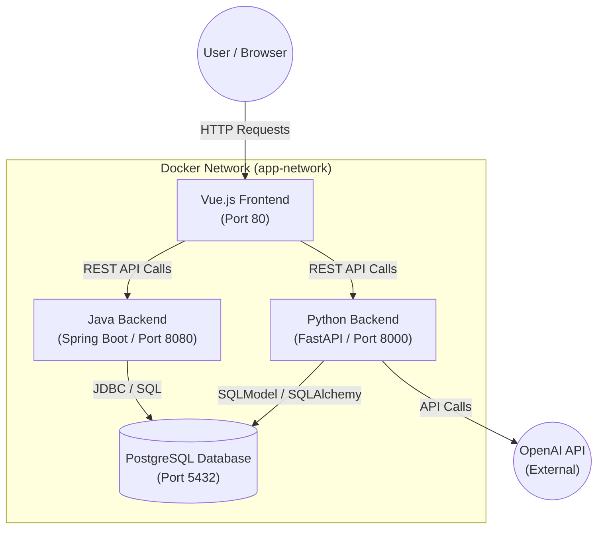

# 00. Kurs-Syllabus & Architektur-Übersicht

Willkommen zur ersten Vorlesung.
Unser Ziel ist nicht nur, Code zu schreiben, sondern ein **Drei-Schichten-System** (Frontend, Backend, Datenbank) im Detail zu verstehen. Wir betreiben hier keine "Bastelstunde", sondern professionelles Software-Engineering mit Microservices-Ansatz.

## 1. Der Lehrplan (Syllabus)

In diesem laufenden Kurs werden wir uns folgende Themengebiete erarbeiten:

| Modul | Thema | Fokus |
| :--- | :--- | :--- |
| **00** | **Architektur & Struktur** | Verständnis des "Big Picture". Wer redet mit wem? |
| **01** | **Backend Deep-Dive (Java)** | Spring Boot, Dependency Injection, Security, JPA. |
| **02** | **AI & Data Science (Python)** | FastAPI, Integration von LLMs (OpenAI), asynchrone Verarbeitung. |
| **03** | **Frontend (Vue.js)** | Components, Reactivity, State Management (Pinia). |
| **04** | **Infrastruktur (Docker)** | Containerisierung, Networking, Deployment. |

---

## 2. Die System-Architektur

Bevor wir eine einzige Zeile Code analysieren, müssen wir die Topologie unseres Netzwerks verstehen.
Wir setzen auf eine **Container-basierte Architektur** mit Docker. Das bedeutet, jeder Dienst läuft isoliert und kommuniziert über definierte Schnittstellen (APIs).

### Das Netzwerk-Diagramm

### Die Komponenten im Detail

#### 1. Das Gesicht: Vue.js Frontend
Hier interagiert der Benutzer. Die Anwendung ist eine SPA (Single Page Application).
- **Aufgabe:** Darstellung von Daten, Entgegennahme von Benutzereingaben.
- **Wichtig:** Das Frontend enthält **keine Geschäftslogik** für kritische Prozesse (z.B. Passwort-Validierung). Es ist nur der "Showroom".

#### 2. Der Verwalter: Java Backend (Spring Boot)
Das Rückgrat unserer Anwendung. Robust, typsicher und strikt.
- **Aufgabe:** Benutzerverwaltung (Auth/JWT), Datenvalidierung, CRUD-Operationen (Create, Read, Update, Delete) für die Haupt-Entitäten.
- **Technologie:** Wir nutzen Spring Boot, weil es den De-Facto-Standard für Enterprise-Backends darstellt.

#### 3. Das Gehirn: Python Backend (FastAPI)
Unsere Spezial-Einheit für AI und Datenverarbeitung.
- **Aufgabe:** Interaktion mit Large Language Models (OpenAI), komplexe Berechnungen.
- **Warum Python?** Python ist die Lingua Franca der KI-Welt. Java wäre hier zu schwerfällig.

#### 4. Das Gedächtnis: PostgreSQL
Unsere Datenbank.
- **Besonderheit:** Sowohl Java als auch Python greifen auf dieselbe Datenbank zu. Das erfordert Disziplin im Schema-Design, damit sich die Anwendungen nicht gegenseitig die Daten korrumpieren.

---

## 3. Nächste Schritte

Im nächsten Modul werden wir uns das **Java Backend** ansehen. Bereiten Sie sich darauf vor, Begriffe wie `Dependency Injection`, `Inversion of Control` und `Entity Management` nicht nur zu hören, sondern zu verstehen.

*Ende der Vorlesung.*
