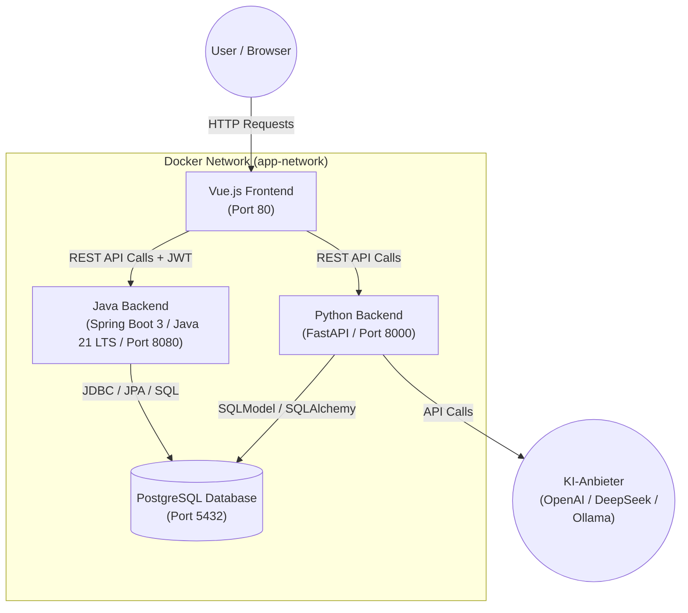

# 00. Kurs-Syllabus & Architektur-Übersicht

Willkommen zur ersten Vorlesung.
Unser Ziel ist nicht nur, Code zu schreiben, sondern ein **Drei-Schichten-System** (Frontend, Backend, Datenbank) im Detail zu verstehen. Wir betreiben hier keine "Bastelstunde", sondern professionelles Software-Engineering mit Microservices-Ansatz.

## 1. Der Lehrplan (Syllabus)

In diesem laufenden Kurs werden wir uns folgende Themengebiete erarbeiten:

| Modul | Thema | Fokus |
| :--- | :--- | :--- |
| **00** | **Architektur & Struktur** | Verständnis des "Big Picture". Wer redet mit wem? |
| **01** | **Infrastruktur Basics (Docker)** | Containerisierung, Netzwerke, Datenbankinitialisierung, Umgebungsvariablen. |
| **02** | **Java Backend Architektur** | Spring Boot 3, Dependency Injection, Schichten-Architektur, JPA, Java Records. |
| **03** | **Python AI Service** | FastAPI, Multi-Provider-KI-Integration (OpenAI, DeepSeek, Ollama), Pydantic. |
| **04** | **Frontend Architektur (Vue.js)** | Components, Reactivity, State Management (Pinia), API Service Layer. |
| **05** | **Security Deep Dive** | JWT, stateless Authentication, RBAC, Spring Security Filter Chain. |
| **06** | **Advanced Appointment Management** | Geschäftslogik im Service Layer, Enums, rollenbasierte API-Absicherung. |
| **07** | **Availability & Calendar** | Smart/Dumb Components, visuelle Verfügbarkeitsanzeige, Backend-Integrität. |
| **08** | **Admin Power & Konfiguration** | Dynamic Configuration Pattern, Database-Driven Config, Admin Dashboard. |
| **09** | **KI-Architektur & Patterns** | Factory Pattern, Polymorphismus, ABC, Audit Logging. |
| **10** | **Full Stack Architektur & UX** | Local AI (Ollama), Audit Logging Middleware, Portfolio CMS, Glassmorphism. |

---

## 2. Die System-Architektur

Bevor wir eine einzige Zeile Code analysieren, müssen wir die Topologie unseres Netzwerks verstehen.
Wir setzen auf eine **Container-basierte Architektur** mit Docker. Das bedeutet, jeder Dienst läuft isoliert und kommuniziert über definierte Schnittstellen (APIs).

### Das Netzwerk-Diagramm

### Die Komponenten im Detail

#### 1. Das Gesicht: Vue.js Frontend
Hier interagiert der Benutzer. Die Anwendung ist eine SPA (Single Page Application).
- **Aufgabe:** Darstellung von Daten, Entgegennahme von Benutzereingaben.
- **Wichtig:** Das Frontend enthält **keine Geschäftslogik** für kritische Prozesse (z.B. Passwort-Validierung). Es ist nur der "Showroom".
- **Technologie:** Vue.js 3 mit Composition API, Vue Router 4, Pinia Store, Vite Build-Tool.

#### 2. Der Verwalter: Java Backend (Spring Boot / Java 21 LTS)
Das Rückgrat unserer Anwendung. Robust, typsicher und strikt.
- **Aufgabe:** Benutzerverwaltung (Auth/JWT), Datenvalidierung, CRUD-Operationen (Create, Read, Update, Delete) für Termine, Portfolio und Konfiguration.
- **Technologie:** Spring Boot 3.2.0, Spring Security 6, Spring Data JPA, PostgreSQL — kompiliert mit **Java 21 LTS** (`--release 21`).

#### 3. Das Gehirn: Python Backend (FastAPI)
Unsere Spezial-Einheit für AI und Datenverarbeitung.
- **Aufgabe:** Interaktion mit Large Language Models über ein flexibles Multi-Provider-System (OpenAI, DeepSeek, Ollama, Mock), Audit-Logging jedes KI-Requests.
- **Warum Python?** Python ist die Lingua Franca der KI-Welt. Java wäre hier zu schwerfällig.

#### 4. Das Gedächtnis: PostgreSQL
Unsere Datenbank.
- **Besonderheit:** Sowohl Java als auch Python greifen auf dieselbe PostgreSQL-Instanz zu, jedoch auf **separate Datenbanken** (`java_db` und `python_db`). Das erfordert Disziplin im Schema-Design, damit sich die Anwendungen nicht gegenseitig die Daten korrumpieren.

---

## 3. Nächste Schritte

Im nächsten Modul (Modul 01) schauen wir uns die **Infrastruktur** genauer an: Wie sind die Docker-Container konfiguriert, wie kommunizieren sie miteinander, und warum gibt es separate Datenbankbenutzer für Java und Python?

*Ende der Vorlesung.*
