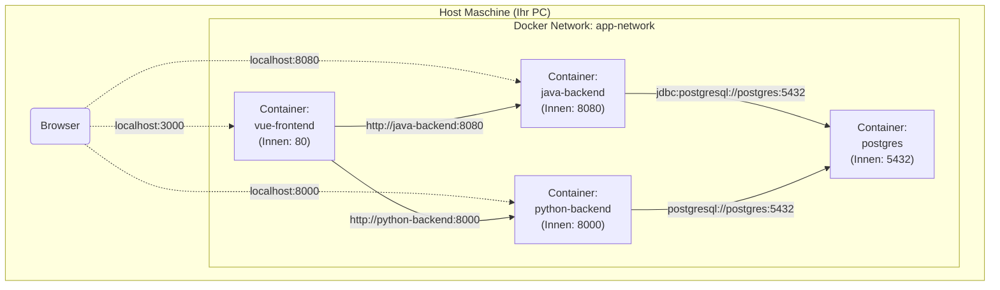

# 01. Infrastruktur Basics: Das Fundament (Sprint 1)

Bevor wir über Code sprechen, müssen wir verstehen, *wo* unser Code läuft. Wir nutzen **Docker**, um eine reproduzierbare Umgebung zu schaffen. "It works on my machine" ist keine Entschuldigung mehr.

## 1. Die Container-Landschaft

Unser System besteht aus vier isolierten Servern (Containern), die in einem privaten Netzwerk (`app-network`) miteinander sprechen.

### Das Netzwerk-Diagramm
Hier ist die physikalische Sicht auf unsere Infrastruktur:



### Wichtige Konzepte

1.  **Service Discovery über DNS:**
    Innerhalb des Docker-Netzwerks kennen sich die Container beim Namen.
    Das Java-Backend muss nicht wissen, welche IP die Datenbank hat. Es verbindet sich einfach mit `jdbc:postgresql://postgres:5432/...`. Der Name `postgres` kommt direkt aus der `docker-compose.yml` (Zeile 74).

2.  **Ports (Innen vs. Außen):**
    -   **Innen:** Der Prozess im Container lauscht oft auf Standard-Ports (Java: 8080, Postgres: 5432).
    -   **Außen (Host):** Wir mappen diese auf Ports Ihres PCs (z.B. Frontend an `3000`).
    -   *Merke:* Die Container untereinander nutzen IMMER die inneren Ports.

## 2. Die Datenbank-Initialisierung

Ein häufiger Anfängerfehler ist es, Backend-Services zu starten, bevor die Datenbank bereit ist.
Unsere Lösung: `docker/init.sql`.

Dieses Skript läuft **automatisch**, wenn der Postgres-Container das *erste Mal* startet (dank des Volume-Mappings in `/docker-entrypoint-initdb.d/`).

### Code-Analyse: `init.sql`

```sql
-- 1. Eigene User für jeden Microservice (Security Best Practice!)
CREATE USER java_user WITH PASSWORD 'java_password';
CREATE USER python_user WITH PASSWORD 'python_password';

-- 2. Strikte Trennung der Datenhoheit
CREATE DATABASE java_db OWNER java_user;
CREATE DATABASE python_db OWNER python_user;
```

**Warum machen wir das?**
Wir verhindern, dass das Python-Backend versehentlich Tabellen des Java-Backends löscht. Jeder Service besitzt seine eigene "Welt" innerhalb des Datenbank-Clusters. Das nennt man **Database-per-Service Pattern**, auch wenn wir physikalisch denselben Server nutzen.

## 3. Environment Variables (`.env`)

Wir hardcoden keine Passwörter im Quellcode. Niemals.
Die `docker-compose.yml` injectet Werte wie `DB_PASSWORD` aus der `.env` Datei in die Container.

-   **Java** liest diese Variablen über `application.properties` (`${DB_PASSWORD}`).
-   **Python** nutzt `pydantic` Settings oder `os.environ`.

Das macht unser System sicher und konfigurierbar für verschiedene Umgebungen (Dev, Test, Prod).
