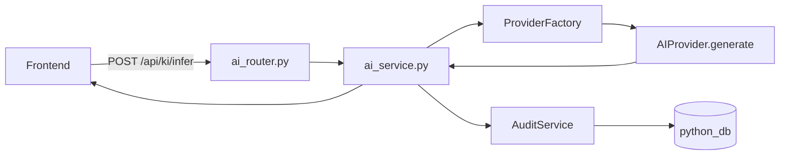

# 03. Python & AI Service: Das Gehirn (Sprint 3)

Unser Python-Backend ist spezialisiert. Es tut genau eine Sache: **Künstliche Intelligenz**.
Wir nutzen **FastAPI**, ein modernes High-Performance Framework, das perfekt für AI/ML-Workloads geeignet ist.

## 1. Warum Python UND Java? (Microservices)
Man könnte fragen: "Warum macht Java das nicht auch?"
-   **Java:** Stark in Enterprise-Daten, Security, Struktur.
-   **Python:** Die #1 Sprache für AI. Alle wichtigen Libraries (PyTorch, OpenAI, LangChain) sind hier zuhause.

Wir nutzen den **Best-of-Breed Ansatz**: Jede Sprache für das, was sie am besten kann.

## 2. FastAPI vs. Spring Boot
Vergleich der Konzepte:

| Konzept | Java (Spring Boot) | Python (FastAPI) |
| :--- | :--- | :--- |
| **Request Handling** | `@RestController` | `@app.get(...)` / `APIRouter` |
| **Dependency Injection** | `@Autowired` / Constructor | Explizite Übergabe (wie bei uns) |
| **Daten-Modelle** | Java Records / DTOs | **Pydantic Models** |
| **Async** | Threads / Reactive Stack | Native `async` / `await` |

## 3. Das Multi-Provider-System

Das Python-Backend unterstützt nicht nur einen KI-Anbieter, sondern **vier verschiedene**:

| Provider | Beschreibung |
| :--- | :--- |
| `openai` | GPT-4 / GPT-3.5 über die offizielle OpenAI API (Cloud, kostenpflichtig) |
| `deepseek` | DeepSeek-Modell über eine OpenAI-kompatible Schnittstelle (günstigere Alternative) |
| `ollama` | Lokale LLMs (Llama, Mistral) über einen Ollama-Server — vollständig offline |
| `mock` | Fest hinterlegte Testantworten — Entwicklung ohne API-Key oder Kosten |

Der Nutzer wählt im Frontend per Dropdown aus, welcher Provider für die aktuelle Anfrage verwendet werden soll.

## 4. Der Code-Flow (Deep Dive)

Wenn das Frontend eine KI-Anfrage stellt, verläuft die Verarbeitung durch vier Schichten:



### Schritt 1: Router (`ai_router.py`)
Nimmt die HTTP-Anfrage entgegen und validiert die JSON-Daten *automatisch* mittels Pydantic.

```python
@router.post("/infer", response_model=InferResponse)
def infer(req: InferRequest, db: Session = Depends(get_db)):
    # Weiterleitung an den Service — der Router selbst enthält keine Logik
    return ai_service.generate_response(req.prompt, req.provider, db)
```

### Schritt 2: Service (`ai_service.py`)
Orchestriert den gesamten Ablauf: Provider anfordern, Inferenz durchführen, Latenz messen und Audit-Log schreiben.

```python
def generate_response(prompt: str, provider_name: str, db: Session):
    start = perf_counter()
    provider = ProviderFactory.get_provider(provider_name)
    response_text = provider.generate(prompt)
    latency_ms = int((perf_counter() - start) * 1000)

    # Jeden Request für Transparenz in der Datenbank festhalten
    audit_service.log_request(db, provider_name, prompt, response_text, latency_ms)
    return InferResponse(response=response_text, provider=provider_name)
```

### Schritt 3: ProviderFactory (`provider_factory.py`)
Zentrale Fabrik — entscheidet, welche Provider-Instanz erstellt wird, und speichert sie im Cache (Singleton-Muster). Fehlt ein API-Key, fällt die Factory automatisch auf `MockProvider` zurück.

```python
class ProviderFactory:
    _cache: dict[str, AIProvider] = {}

    @classmethod
    def get_provider(cls, name: str) -> AIProvider:
        if name not in cls._cache:
            cls._cache[name] = cls._create(name)
        return cls._cache[name]
```

## 5. Pydantic: Das Killer-Feature
Schauen Sie in `models/dtos.py`.
Pydantic garantiert, dass die Daten valide sind. Wenn `prompt` fehlt oder `provider` keinen bekannten Wert enthält, wirft FastAPI automatisch einen strukturierten Fehler ans Frontend — *bevor* unser Code überhaupt ausgeführt wird. Das spart uns hunderte Zeilen manueller Validierung.

## 6. Audit Logging: Transparenz über KI-Nutzung

Jeder KI-Request wird in der Tabelle `ai_audit_logs` (Datenbank `python_db`) protokolliert:

| Feld | Beschreibung |
| :--- | :--- |
| `provider` | Welcher KI-Anbieter wurde benutzt? (`openai`, `ollama`, ...) |
| `prompt_preview` | Die ersten 500 Zeichen des Prompts |
| `response_preview` | Die ersten 500 Zeichen der Antwort |
| `latency_ms` | Wie lange hat die Antwort gedauert? (in Millisekunden) |
| `timestamp` | Zeitstempel des Requests |

**Warum ist das wichtig?**
Nur durch konsequentes Logging lässt sich nachvollziehen, welcher Provider wie schnell und teuer ist, und ob ungewöhnliche Anfragen auftreten. Das ist die unverzichtbare Grundlage für Qualitätssicherung und Kostenanalyse in produktiven KI-Systemen.
