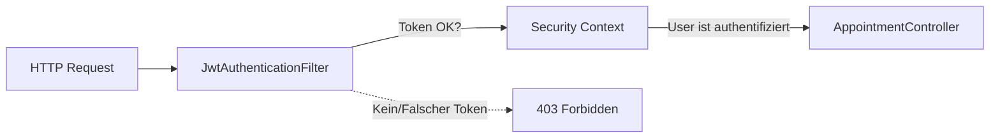

# 05. Security: Der Türsteher (Sprint 5)

Security ist kein Feature, das man am Ende "dranbaut". Es ist ein fundamentaler Teil der Architektur.
Wir nutzen **JWT (JSON Web Tokens)** für eine **stateless** Authentifizierung.

## 1. Stateless vs. Stateful (Sessions)
Früher (und bei vielen PHP/Java Apps) gab es "Sessions".
-   **Stateful:** Der Server merkt sich: "SessionID 123 gehört Kevin".
-   **Stateless (Wir):** Der Server merkt sich NICHTS.
    Der User bekommt einen Ausweis (Token). Diesen Ausweis muss er bei JEDER Anfrage vorzeigen.
    *Vorteil:* Skalierbarkeit. Wir können 100 Server starten, keiner muss Sessions synchronisieren.

## 2. Der Login-Flow
Was passiert, wenn Sie auf "Login" klicken?

1.  **Vue:** Schickt `POST /api/auth/login` mit Username/Password.
2.  **SpringBoot (`AuthController`):** Prüft Passwort (via `AuthenticationManager`).
3.  **Success:** Generiert einen JWT String.
    Darin steht signiert: "Das ist Kevin, gültig bis 14:00 Uhr".
4.  **Vue:** Speichert den Token (im Pinia Store / LocalStorage).

## 3. Der Request-Filter (`JwtAuthenticationFilter`)
Jedes Mal, wenn Vue nun Daten will (`GET /api/termine`), läuft der Request durch eine "Sicherheitsschleuse".

### Die Filter Chain
Bevor der `AppointmentController` überhaupt aufgerufen wird, fängt Spring Security den Request ab.



### Code-Analyse
```java
// JwtAuthenticationFilter.java
String header = request.getHeader("Authorization"); // "Bearer eyJhbGci..."

if (jwtUtil.validateToken(token)) {
    // Tür aufmachen:
    SecurityContextHolder.getContext().setAuthentication(user);
}
```

## 4. Konfiguration (`SecurityConfig`)
Hier definieren wir die Regeln:
-   `/api/auth/**` -> Reinlassen (sonst könnte sich niemand einloggen).
-   `/api/termine/**` -> Nur mit gültigem Token.
-   `csrf.disable()` -> Nötig für APIs (CSRF ist ein Browser-Session-Angriffsszenario).

Wir haben ein **Hochsicherheitssystem** gebaut, das Industriestandards entspricht.
