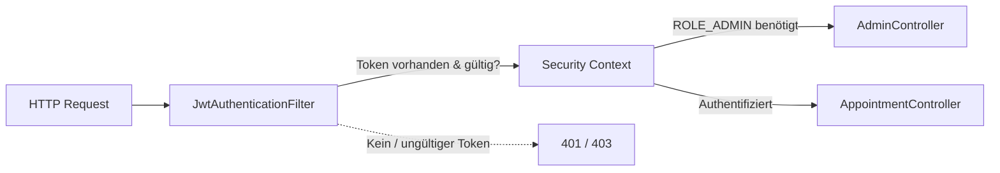

# 05. Security: Der Türsteher (Sprint 5)

Security ist kein Feature, das man am Ende "dranbaut". Es ist ein fundamentaler Teil der Architektur.
Wir nutzen **JWT (JSON Web Tokens)** für eine **stateless** Authentifizierung in Kombination mit **rollenbasierter Zugriffskontrolle** (RBAC).

## 1. Stateless vs. Stateful (Sessions)
Früher (und bei vielen PHP/Java Apps) gab es "Sessions".
-   **Stateful:** Der Server merkt sich: "SessionID 123 gehört Kevin".
-   **Stateless (Wir):** Der Server merkt sich NICHTS.
    Der User bekommt einen Ausweis (Token). Diesen Ausweis muss er bei JEDER Anfrage vorzeigen.
    *Vorteil:* Skalierbarkeit. Wir können 100 Server starten, keiner muss Sessions synchronisieren.

## 2. Der Login-Flow
Was passiert, wenn Sie auf "Login" klicken?

1.  **Vue:** Schickt `POST /api/auth/login` mit Benutzername und Passwort (HTTPS verschlüsselt).
2.  **Spring Boot (`AuthController`):** Prüft das Passwort via BCrypt-Vergleich (`AuthenticationManager`).
3.  **Erfolg:** Generiert einen JWT-Token (10 Stunden gültig).
    Darin steht kryptografisch signiert: "Das ist Kevin, Rolle: ROLE_ADMIN, gültig bis 14:00 Uhr".
4.  **Vue:** Speichert den Token im Pinia Store und im `localStorage`.

## 3. Der Request-Filter (`JwtAuthenticationFilter`)
Jedes Mal, wenn Vue Daten anfordert, läuft der Request zuerst durch die "Sicherheitsschleuse".

### Die Filter Chain
Bevor der eigentliche Controller aufgerufen wird, fängt Spring Security jeden Request ab.



### Code-Analyse
```java
// JwtAuthenticationFilter.java
String header = request.getHeader("Authorization"); // "Bearer eyJhbGci..."

if (jwtUtil.validateToken(token)) {
    // Tür aufmachen: Nutzer in den SecurityContext eintragen
    SecurityContextHolder.getContext().setAuthentication(user);
}
```

## 4. Rollensystem (RBAC – Role-Based Access Control)

Nicht alle eingeloggten Nutzer haben dieselben Rechte. Wir unterscheiden zwei Rollen:

| Rolle | Beschreibung |
| :--- | :--- |
| `ROLE_USER` | Standard-Nutzer: kann Termine buchen, eigenes Profil lesen |
| `ROLE_ADMIN` | Administrator: kann Termine bestätigen, löschen und Konfiguration ändern |

Die Rolle wird beim Login in den JWT kodiert und bei jedem Request automatisch ausgelesen.

## 5. Die Zugriffs-Regeln in `SecurityConfig`

Hier definieren wir präzise, wer welchen Endpunkt aufrufen darf:

```java
.authorizeHttpRequests(auth -> auth
    // Öffentlich: Login und Registrierung — sonst kann sich niemand einloggen
    .requestMatchers("/api/auth/**").permitAll()
    // Öffentlich: Portfolio-Liste lesen (jeder Besucher darf das sehen)
    .requestMatchers(HttpMethod.GET, "/api/portfolio").permitAll()
    // Öffentlich: Termine und Konfiguration lesen
    .requestMatchers(HttpMethod.GET, "/api/termine", "/api/termine/config").permitAll()
    // Nur Admin: Termine bestätigen / löschen, Config ändern, Portfolio verwalten
    .requestMatchers(HttpMethod.PUT, "/api/termine/*/confirm").hasRole("ADMIN")
    .requestMatchers(HttpMethod.DELETE, "/api/termine/**").hasRole("ADMIN")
    .requestMatchers("/api/admin/**").hasRole("ADMIN")
    // Alles andere: mindestens eingeloggt sein
    .anyRequest().authenticated()
)
```

Eine wichtige Designentscheidung ist hier das **Prinzip der minimalen Rechtevergabe**: Wir erlauben öffentlichen Lesezugriff nur dort, wo er wirklich nötig ist (Portfolio anzeigen, Terminübersicht anzeigen), und sperren alle schreibenden und administrativen Aktionen konsequent ab.

## 6. Warum kein CSRF-Schutz?

```java
csrf.disable()
```

CSRF (Cross-Site Request Forgery) ist ein Angriff, der Session-Cookies missbraucht. Da wir **keine Cookies** verwenden, sondern den Token im `Authorization`-Header übermitteln, ist CSRF strukturell ausgeschlossen. Ein fremde Webseite kann den Header nicht automatisch setzen — sie hätte dazu Zugriff auf den Token im `localStorage` benötigen, was einen XSS-Angriff voraussetzt.

Wir haben damit ein System gebaut, das modernen Industrie-Standards für zustandslose REST-APIs entspricht.
